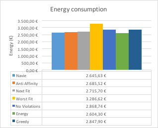
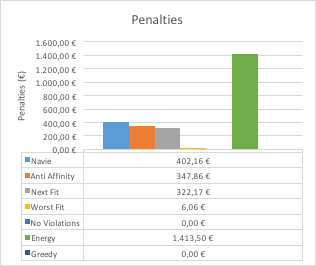
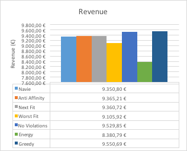

# Notes about the project

## The team
##### EIT Digital, Data Science

- Diego Burgos Sancho: diego.bursan@gmail.com
- Ivan López Moreno: ivan.lopezm.edu@gmail.com

# Results
##Results

###Exercise 1 - Naive Algorithm
| Results   | €         |
| --------- |:---------:|
| Incomes   | 12398,59 € |
| Penalties | 402,16 €   |
| Energy    | 2645,63 €  |
| Revenue   | 9350,80 €  |
###Exercise 2 - Anti Affinity Algorithm
| Results   | €         |
| --------- |:---------:|
| Incomes   | 12398,59€ |
| Penalties | 347,86 €  |
| Energy    | 2685,52 €  |
| Revenue   | 9365,21 €  |

###Exercise 3 - Next Fit Algorithm
| Results   | €         |
| --------- |:---------:|
| Incomes   | 12398,59€ |
| Penalties | 322,17 €   |
| Energy    | 2715,70 €  |
| Revenue   | 9360,72 €  |

###Exercise 3-2 - Worst Fit Algorithm
| Results   | €         |
| --------- |:---------:|
| Incomes   | 12398,59€ |
| Penalties | 6,06€     |
| Energy    | 3286,62€  |
| Revenue   | 9105,92€  |

###Part 4
| Results   | €         |
| --------- |:---------:|
| Incomes   | 12398,59€ |
| Penalties | 0,00€     |
| Energy    | 2868,74€  |
| Revenue   | 9529,85€  |

###Part 5
| Results   | €         |
| --------- |:---------:|
| Incomes   | 12398,59€ |
| Penalties | 1413,50€ |
| Energy    | 2604,30€  |
| Revenue   | 8380,79€  |

###Part 6
| Results   | €         |
| --------- |:---------:|
| Incomes   | 12398,59€ |
| Penalties | 0,00€ |
| Energy    | 2847,90€  |
| Revenue   | 9550,69€  |

## Comments
### About the exercises
#### A naive scheduler to start
The flag for testing this algorithm is `naive` and the java class that implements this algorithm is NaiveVmAllocationPolicy.

This algorithm iterates the available host until when it finds one that can allocate the vm. Then, the vm is allocated on that serer.

The complexity of this algorithm is O(n), where n is the number of host visited before to allocate the vm on a host.

#### Support for Highly-Available applications
The flag for testing this algorithm is `antiAffinity` and the java class that implements this algorithm is AntiAffinityVmAllocationPolicy.

1. What is the theoretical complexity of this algorithm?
The complexity of this algorithm is linear.
In the best case, we need to find a host where this vm can be allocated and check all the vms of this host to check if there is 
any vm inside the range where this vm can be allocated.
In the worst case, we would need to check all the hosts (because all of them can allocate the vm) but only in the last one the vm
can be allocated. In this case, the complexity is O(n*p), where n is the number of hosts and p is the number of vm of one host.  

2. What is the impact of such an algorithm over the cluster hosting capacity? Why?
The capacity decreases, because now we do not have all the hosts anymore to find the best each vm. 
The profits is a few larger than the naive scheduler because with this policy, the penalties decreases.

#### Balance the load
The flag for testing this algorithm is `nextFit` and the java class that implements this algorithm is NextFitVmAllocationPolicy.
The flag for testing this algorithm is `worstFit` and the java class that implements this algorithm is WorstFitVmAllocationPolicy.

1. Which algorithms performs the best in terms of reducing the SLA violation. Why?
Obviously, the worst fit algorithm, because the vm is going to be allocated on the host with more mips and ram available.
Consequently, the number of SLA violations will be smaller. 

2. What is the theoretical complexity of each of the implemented scheduler?
- For the next fit algorithm, the complexity is O(n), where n is the number of host visited before
to allocate the vm. This complexity is smaller than naive's complexity because the algorithm starts
from the last allocated host.
The problem is that, when using this policy in a real environment, the allocateHostForVm method needs to be synchronized to protect
the variable that keeps the last host allocated. This is needed when there are many threads allocating vms.
- For the worst fit policy, the complexity of the method implemented is O(n), where n is number of hosts. In this algorithm we need to
access to all the hosts to find the one with more ram and mips available, so we need to iterate all the host list.

#### Get rid of SLA violations
The flag for testing this algorithm is `noViolations` and the java class that implements this algorithm is NoViolationsVmAllocationPolicy.

#### Energy-efficient schedulers
The flag for testing this algorithm is `energy` and the java class that implements this algorithm is EnergyVmAllocationPolicy.
We saw that the naive policy the policy that requires less energy. That is because the algorithm try to fill all the first hosts of 
the list, so there are some servers with a high load and some servers with low load. 
That is the reason why we decided to sort all the host by mips available and try to allocate the vm in the host with less mips available. 

We can appreciate on the next graph that this algorithm is which one requires less energy to allocate all the vms.

But the biggest problem of this algorithm is that the penalties are too high. Consequently, the profit is not the best.
We can appreciate it on the next graph.

#### Greedy scheduler
The flag for testing this algorithm is `greedy` and the java class that implements this algorithm is GreedyVmAllocationPolicy.

We allocate the vm on the host with less mips available, with enough memory and mips and that cannot originate SLA conflicts.
With this policy, we get the best result, because we get more profits. The result can be appreciated on the next graph.

